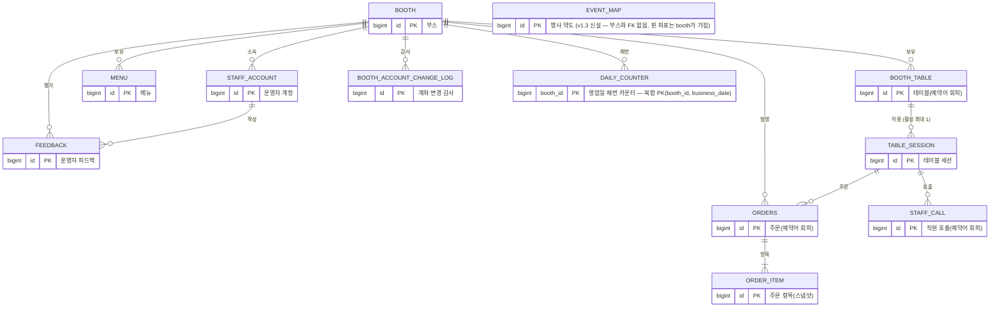

# 부스락 DB 스키마 v1.3

> 원천: API 명세서 v0.5 §6 데이터 모델. 대상 DB: MySQL 8. 로컬 개발·실습은 H2 — 단, JDBC URL에 `;MODE=MySQL`을 붙여야 이 스키마와 호환된다 (H2 기본 모드는 DATETIME 타입을 지원하지 않아 실행이 실패함).
> v1.1 변경: MySQL 8.4·H2 2.4 실행 검증 결과 반영 — 멱등키 NULL 허용, password_hash 72자, call→staff_call 개명, 세션 유일성 제약 승격, utf8mb4 명시, 타임존·조건부 UPDATE 원칙 추가.
> v1.2 변경: 2차 재검증 반영 — 토큰·멱등키 `utf8mb4_bin`(대소문자 구분), ended_at_key를 epoch초→자기 id 방식으로, ERD 관계·PK 표기 보정.
> v1.2.1 변경: `orders.table_label` 추가 — 주문 시점 테이블 라벨 스냅샷(O10 표시·O19 CSV용).
> **v1.3 변경 (2026-09-07 회의 결정 반영)**: ① `booth`에 `category`·`map_x`·`map_y` 추가 — 손님 홈 화면의 부스 분류와 약도 핀 위치(API E1·E2) ② `booth_table`에 `pos_x`·`pos_y` 추가 — 운영자 POS형 배치도의 테이블 상자 위치(API O3·O22) ③ **`event_map` 테이블 신설** — 행사 약도 이미지 1건 ④ 파일럿 전제가 단일 부스에서 복수 부스로 바뀌어 부스·계정·약도 시딩이 실질 필수가 됨 ⑤ 좌석 현황을 `booth_table.status`가 아니라 `table_session`의 종료 여부와 마지막 활동 시각으로 판정(원칙 14) ⑥ 좌표 컬럼을 `Integer`로 두어야 하는 이유 정정(원칙 설명·pos_y 참조).
> **v1.3.1 변경**: `menu`에 `category` 추가(NULL 허용) — 메인메뉴/사이드/음료 분류. 기존 메뉴는 NULL로 남고, 소비자 메뉴판(C2)에서는 미분류로 취급돼 "전체" 탭에서만 노출된다. O7·O8 요청 필드와 C2 응답에 반영.
> **v1.3.2 변경**: `booth`에 `depositor_name` 추가(NULL 허용) — 계좌 등록 화면의 예금주명 표시용 라벨. `bank_account`와 같은 화면·같은 ADMIN 권한으로 O16·O17에 반영하되, 입금 경로 자체를 바꾸지 않는 표시값이라 감사 로그·웹훅 대상에서는 제외했다.
> 규칙: 엔티티에는 반드시 `@Table(name = "...")`로 아래 테이블명을 명시한다 (Hibernate 자동 이름에 맡기지 않음).

## 0. 전체 관계도 (ERD)



## 1. 테이블별 상세 정의 + 소유 파트

### booth — 부스 (담당: 황대겸)

| 컬럼 | 타입 | 제약 | 설명 |
|---|---|---|---|
| id | BIGINT | PK, AUTO_INCREMENT | |
| name | VARCHAR(50) | NOT NULL | 부스명 (소비자 화면 상단 표시) |
| bank_account | VARCHAR(100) | NOT NULL | 계좌 표기 문자열 — C3 응답에 그대로 노출. 변경은 감사 로그 필수 |
| depositor_name | VARCHAR(50) | NULL | **v1.3.2 신설** — 예금주명(계좌 등록 화면 표시용 라벨). bank_account와 달리 입금 경로 자체를 바꾸지 않아 감사 로그·웹훅 대상은 아님(§3 원칙 추가 예정) |
| is_open | BOOLEAN | NOT NULL DEFAULT TRUE | 주문 접수 스위치 — FALSE면 주문 409 ORDER_CLOSED |
| operating_hours | VARCHAR(50) | NULL | 안내용 텍스트 (서버가 시간으로 주문을 막지 않음) |
| category | VARCHAR(20) | NULL | **v1.3 신설** — 홈 화면 부스 분류. `FOOD` / `CAFE` / `GOODS` / `ETC`. E1 응답·필터용. NULL이면 미분류로 표시 |
| map_x | INT | NULL | **v1.3 신설** — 약도 위 부스 핀의 가로 위치. **0~10000 상대 좌표**(0.00%~100.00%). 픽셀이 아닌 비율로 저장해야 약도 이미지를 교체·리사이즈해도 핀이 제자리에 남는다 |
| map_y | INT | NULL | **v1.3 신설** — 세로 위치. 규칙은 map_x와 동일. **map_x·map_y 중 하나만 있는 상태는 앱에서 막을 것** — 반쪽 좌표는 지도에 찍을 수 없다 |

### staff_account — 운영자 계정 (담당: 황대겸)

| 컬럼 | 타입 | 제약 | 설명 |
|---|---|---|---|
| id | BIGINT | PK, AUTO_INCREMENT | |
| booth_id | BIGINT | FK→booth, **NULL 허용** | SUPER_ADMIN은 무소속(NULL) — 명세서 §1.2 |
| login_id | VARCHAR(50) | NOT NULL, **UNIQUE** | 부스명에서 유추 불가한 값으로 발급 |
| password_hash | VARCHAR(72) | NOT NULL | bcrypt — Spring 기본 DelegatingPasswordEncoder는 `{bcrypt}` 접두를 붙여 68자를 저장하므로 60자로 잡으면 INSERT가 실패한다 |
| password_changed_at | DATETIME | NOT NULL | JWT pwdAt 클레임 대조 — 재발급 시 기존 토큰 무효화 |
| role | VARCHAR(20) | NOT NULL | SUPER_ADMIN / ADMIN / STAFF — **문자열 저장(@Enumerated STRING)** |
| active | BOOLEAN | NOT NULL DEFAULT TRUE | 정지 시 FALSE — 매 요청 확인 |
| failed_login_count | INT | NOT NULL DEFAULT 0 | 지수 백오프 잠금용 |
| locked_until | DATETIME | NULL | 잠금 해제 시각 |

### booth_table — 테이블 (담당: 전형준) — 주의: `TABLE`은 SQL 예약어라 이름을 booth_table로

| 컬럼 | 타입 | 제약 | 설명 |
|---|---|---|---|
| id | BIGINT | PK, AUTO_INCREMENT | |
| booth_id | BIGINT | FK→booth, NOT NULL | |
| label | VARCHAR(20) | NOT NULL | **원본 표기 그대로 저장** (예: "A-3") — 정규화(하이픈·공백 제거+대문자, 6자 이내, 단독 "M" 금지)는 검증·주문번호 조립 시점에 적용. 응답의 tableLabel은 원본, orderNo는 정규화본. **등록 시 정규화 결과의 부스 내 유일성도 앱에서 검증할 것** — 원본 기준 UNIQUE만으로는 "A-3"과 "A3"의 동시 등록을 못 막는다(실측) |
| table_token | VARCHAR(64) | NOT NULL, **UNIQUE**, `COLLATE utf8mb4_bin` | QR 속 비밀값 — CSPRNG 128bit 이상, URL-safe. **bin 필수**: 기본 ai_ci는 대소문자를 무시해 틀린 토큰으로도 인증이 통과한다(실측) |
| status | VARCHAR(20) | NOT NULL DEFAULT 'EMPTY' | EMPTY / OCCUPIED — 사용중 전환은 자동이지만 **지금 코드에는 빈자리로 되돌리는 코드가 없다(예정 경로 O6 퇴실은 스텁).** 즉 이 컬럼은 한번 OCCUPIED가 되면 되돌아오지 않으므로 **좌석 현황 집계의 근거로 쓰지 말 것** (원칙 14) |
| pos_x | INT | NULL | **v1.3 신설** — 운영자 배치도에서 테이블 상자의 가로 위치(px, 캔버스 좌상단 원점). O22로 저장, O3 응답에 포함. NULL은 아직 배치하지 않은 테이블 |
| pos_y | INT | NULL | **v1.3 신설** — 세로 위치(px). **엔티티에서 `int`가 아니라 `Integer`로 선언할 것** — 컬럼이 생기기 전부터 있던 행은 값이 NULL인데, 프리미티브 `int`면 그 행을 읽는 순간 NULL을 int에 넣지 못해 예외가 난다(H2 파일 DB로 실측. `ddl-auto=update`의 컬럼 추가 자체는 NULL 허용으로 성공한다). **표시 전용이라 주문·세션·QR 어디에도 영향이 없다** — 잘못 저장돼도 운영에 지장이 없고 상자가 겹치는지는 화면에서 판단한다 |
| _UNIQUE_ | | **(booth_id, label)** | 부스 내 라벨 중복 금지 |

### table_session — 테이블 세션 (담당: 전형준)

| 컬럼 | 타입 | 제약 | 설명 |
|---|---|---|---|
| id | BIGINT | PK, AUTO_INCREMENT | |
| table_id | BIGINT | FK→booth_table, NOT NULL | |
| session_token | VARCHAR(64) | NOT NULL, **UNIQUE**, `COLLATE utf8mb4_bin` | 손님 인증값 (X-Session-Token) — 토큰류는 대소문자 구분 저장 |
| started_at | DATETIME | NOT NULL | |
| ended_at | DATETIME | NULL | **NULL = 활성** — 퇴실·자동만료 시 기록 |
| last_activity_at | DATETIME | NOT NULL | 주문·호출·폴링 시각 — 유휴 만료 판정 재료 |
| ended_at_key | BIGINT | NOT NULL DEFAULT 0 | 활성=0, **종료 시 자기 id를 기록** — id는 유일하고 0이 될 수 없어 충돌이 원천 불가. (epoch초 방식은 같은 테이블의 두 세션이 같은 초에 종료되면 UNIQUE 충돌로 퇴실이 실패함 — 실측) |
| _UNIQUE_ | | **(table_id, ended_at_key)** | 테이블당 활성 세션 1개를 DB가 물리적으로 강제 |

(주의) **"테이블당 활성 세션 최대 1개" 제약**: MySQL은 부분 UNIQUE 인덱스(`WHERE ended_at IS NULL`)를 지원하지 않고, 트랜잭션으로 묶는 것만으로는 부족하다 — InnoDB의 일반 SELECT는 비잠금 읽기라 일행이 같은 QR을 동시에 스캔하면 두 요청 모두 "활성 세션 없음"으로 판정해 세션이 2개 생긴다. → **`ended_at_key` 방식이 기본안**: 동시 생성 2건 중 1건을 DB가 거부하고, 퇴실 후 재생성은 정상 허용됨(실행 검증 완료). 세션 생성 진입점이 C1(전형준)·O14(홍화수) 두 곳이라 코드 규율만으로는 지켜지기 어렵다.

### menu — 메뉴 (담당: 권희원)

| 컬럼 | 타입 | 제약 | 설명 |
|---|---|---|---|
| id | BIGINT | PK, AUTO_INCREMENT | |
| booth_id | BIGINT | FK→booth, NOT NULL | |
| name | VARCHAR(50) | NOT NULL | |
| price | INT | NOT NULL, ≥0(앱 검증) | 원 단위 정수 (0원 = 서비스 메뉴 허용) — 범위는 DB CHECK가 아니라 앱에서 검증 |
| image_url | VARCHAR(500) | NULL | O9 업로드 결과 |
| description | VARCHAR(200) | NULL | 알레르기 유발 재료 표기 위치 |
| sold_out | BOOLEAN | NOT NULL DEFAULT FALSE | 원클릭 품절 — **재고 수량 컬럼은 존재하지 않음(팀 확정)** |
| visible | BOOLEAN | NOT NULL DEFAULT TRUE | 숨김 — 소비자 조회에서 제외. **DELETE 없음(숨김으로 대체)** |
| category | VARCHAR(20) | NULL | MAIN / SIDE / DRINK. 미지정(NULL) 메뉴는 소비자 메뉴판 "전체" 탭에서만 노출 (v1.3.1) |

### orders — 주문 (담당: 홍화수) — 주의: `ORDER`는 SQL 예약어라 이름을 orders로

| 컬럼 | 타입 | 제약 | 설명 |
|---|---|---|---|
| id | BIGINT | PK, AUTO_INCREMENT | 내부 불변 식별자 |
| booth_id | BIGINT | FK→booth, NOT NULL | |
| session_id | BIGINT | FK→table_session, **NULL 허용** | 수기 주문(테이블 미지정)은 NULL |
| order_no | VARCHAR(20) | NOT NULL | 사람용 번호 "A3-17" — **영업일 내에서만 유일** |
| table_label | VARCHAR(20) | **NULL 허용** | **스냅샷** — 주문 시점 테이블 라벨 원본(예 "A-3"). orders가 세션을 JPA 연관이 아닌 ID로만 참조해 표시용 조인이 비싸므로 O10 주문 카드 표시·O19 정산 CSV의 `테이블` 컬럼용으로 저장. 수기 주문(O14)은 NULL (v1.2.1 추가) |
| business_date | DATE | NOT NULL | 영업일 = (생성시각−6h)의 날짜 |
| order_seq | INT | NOT NULL | 부스 영업일 통산 순번 |
| idempotency_key | VARCHAR(64) | **NULL 허용**, UNIQUE, `COLLATE utf8mb4_bin` | 멱등 장부 — 더블탭 방지. **수기 주문(O14)은 멱등키가 없으므로 NULL** — NOT NULL로 바꾸면 수기 주문 INSERT가 물리적으로 실패하고, 반대로 UNIQUE를 제거하면 C3 더블탭 방지가 통째로 사라진다. 이 조합 그대로 유지할 것. bin: 기본 ai_ci는 `abc`와 `ABC`를 같은 키로 취급(실측) |
| status | VARCHAR(20) | NOT NULL | RECEIVED / DONE / CANCELED (STRING 저장) |
| payment_status | VARCHAR(20) | NOT NULL | UNPAID / PAID / REFUND_NEEDED / REFUNDED |
| payment_method | VARCHAR(20) | NULL | BANK_TRANSFER / CASH — 입금확인 시 기록 |
| total_amount | INT | NOT NULL | 서버 재계산 금액 |
| cancel_reason | VARCHAR(100) | NULL | 운영자 취소 시 필수 기록 |
| canceled_by / canceled_at | VARCHAR(50) / DATETIME | NULL | 취소자·시각 (분쟁 방지) |
| approved_by / approved_at | VARCHAR(50) / DATETIME | NULL | 입금 승인자·시각 |
| refunded_by / refunded_at | VARCHAR(50) / DATETIME | NULL | 환불 처리자·시각 |
| is_manual | BOOLEAN | NOT NULL DEFAULT FALSE | 수기 주문 표시 |
| created_at | DATETIME | NOT NULL | |
| _UNIQUE_ | | **(booth_id, business_date, order_seq)** | 채번 중복의 물리적 차단 — 최후 방어선 |
| _INDEX_ | | (booth_id, business_date, order_no) | 대시보드 주문번호 검색(q)용 |

※ **paymentGuide(계좌 안내 문구)는 컬럼이 아니다** — 부스 계좌+금액+주문번호로 조립되는 파생값이라 응답 시점에 생성한다. ※ 실습 코드에는 저장돼 있음 → 팀 통합 시 제거 대상.

### order_item — 주문 항목 (담당: 홍화수)

| 컬럼 | 타입 | 제약 | 설명 |
|---|---|---|---|
| id | BIGINT | PK, AUTO_INCREMENT | |
| order_id | BIGINT | FK→orders, NOT NULL | 주문 삭제 없음 → ON DELETE 불필요 |
| menu_id | BIGINT | NOT NULL | 참조용 (FK 강제하지 않음 — 메뉴는 숨김만 되지만 안전상 스냅샷이 본체) |
| menu_name | VARCHAR(50) | NOT NULL | **스냅샷** — 이후 메뉴 변경과 무관하게 불변 |
| unit_price | INT | NOT NULL | **스냅샷** |
| qty | INT | NOT NULL, 1~30(앱 검증 @Min/@Max) | |

※ subtotal(소계)은 컬럼이 아니다 — unit_price×qty 파생값.

### daily_counter — 영업일 채번 카운터 (담당: 홍화수)

| 컬럼 | 타입 | 제약 | 설명 |
|---|---|---|---|
| booth_id | BIGINT | **복합 PK**, FK→booth | |
| business_date | DATE | **복합 PK** | |
| last_seq | INT | NOT NULL DEFAULT 0 | `SELECT ... FOR UPDATE`로 잠그고 +1 |

※ 실습 코드는 단일 부스라 business_date 단독 PK — **팀 스키마는 booth_id 포함 복합 PK가 정본** (다부스 확장 대비, 명세서 §2 채번이 부스 단위). 명세서 §2의 표기 `booth_daily_counter`는 이 테이블을 가리킨다 — 테이블명은 `daily_counter`가 정본이며 명세서 차기 개정 시 표기를 통일한다.

### staff_call — 직원 호출 (담당: 김재원) — 주의: `CALL`은 SQL 예약어라 이름을 staff_call로

| 컬럼 | 타입 | 제약 | 설명 |
|---|---|---|---|
| id | BIGINT | PK, AUTO_INCREMENT | |
| session_id | BIGINT | FK→table_session, NOT NULL | 테이블 라벨은 세션→테이블로 조인 |
| reason | VARCHAR(10) | NOT NULL | HELP / WATER / ETC |
| acked | BOOLEAN | NOT NULL DEFAULT FALSE | 확인 처리 시 TRUE — 대시보드는 FALSE만 노출 |
| created_at | DATETIME | NOT NULL | 30초 재호출 제한 판정 재료 |

### feedback — 운영자 피드백 (담당: 백지연)

| 컬럼 | 타입 | 제약 | 설명 |
|---|---|---|---|
| id | BIGINT | PK, AUTO_INCREMENT | |
| booth_id | BIGINT | FK→booth, NOT NULL | |
| staff_id | BIGINT | FK→staff_account, NOT NULL | 운영자가 부스락 서비스를 평가 (소비자 설문 아님) |
| rating | INT | NOT NULL, 1~5(앱 검증 @Min/@Max) | JPA `int` 매핑이 만드는 타입과 일치시키기 위해 INT |
| easy_setup / easy_orders / would_reuse | BOOLEAN ×3 | NOT NULL | 항목 평가 3종 |
| comment | VARCHAR(1000) | NULL | |
| created_at | DATETIME | NOT NULL | |

### booth_account_change_log — 계좌 변경 감사 (담당: 황대겸)

| 컬럼 | 타입 | 제약 | 설명 |
|---|---|---|---|
| id | BIGINT | PK, AUTO_INCREMENT | |
| booth_id | BIGINT | FK→booth, NOT NULL | |
| changed_by | VARCHAR(50) | NOT NULL | 변경한 계정 |
| changed_at | DATETIME | NOT NULL | |
| old_value / new_value | VARCHAR(100) ×2 | NOT NULL | 돈이 움직이는 유일한 지점의 전후 기록 |

### event_map — 행사 약도 (담당: 홍화수 — API 명세 v0.5 확정필요 #4에서 확정 예정) — v1.3 신설

| 컬럼 | 타입 | 제약 | 설명 |
|---|---|---|---|
| id | BIGINT | PK, AUTO_INCREMENT | |
| image_url | VARCHAR(300) | NOT NULL | 약도 이미지 경로 (예: /uploads/event/map.png). O9 업로드와 같은 정적 서빙 규칙을 따른다 |
| width | INT | NOT NULL | 원본 이미지 가로 px — 클라이언트가 booth의 0~10000 상대 좌표를 화면 픽셀로 환산할 때 쓴다 |
| height | INT | NOT NULL | 원본 세로 px |
| updated_at | DATETIME | NOT NULL | 약도 교체 시각 (클라이언트 캐시 무효화 판단용) |

- **파일럿은 행 1건**이다. 행사가 하나이므로 여러 약도를 관리하지 않으며, 조회(E2)는 **`id DESC` 기준 1건**을 반환한다 (updated_at은 사람이 넣는 값이라 과거 시각이 들어갈 수 있어 정렬 기준으로 쓰지 않는다)
- 부스와 **FK 관계가 없다**. 부스 핀 위치는 booth.map_x·map_y가 갖고 이 테이블은 배경 그림만 갖는다 — 약도를 바꿔도 부스 좌표는 그대로 유효하다(상대 좌표라서)
- 등록은 시딩으로 한다. 운영자용 업로드 API는 만들지 않는다 (행사당 1장이라 API를 둘 이익이 없음)

## 2. DDL (MySQL 8 — 참고용, 개발은 JPA ddl-auto가 생성)

> 전 테이블 utf8mb4 고정 — 서버 기본 charset에 의존하지 않는다. 기본값이 utf8mb3인 환경에서는 이모지 등 4바이트 문자(feedback.comment, menu.name)가 삽입 실패함이 실측으로 확인됨.

```sql
CREATE TABLE booth (
  id              BIGINT AUTO_INCREMENT PRIMARY KEY,
  name            VARCHAR(50)  NOT NULL,
  bank_account    VARCHAR(100) NOT NULL,
  depositor_name  VARCHAR(50)  NULL,
  is_open         BOOLEAN      NOT NULL DEFAULT TRUE,
  operating_hours VARCHAR(50),
  category        VARCHAR(20)  NULL,
  map_x           INT          NULL,
  map_y           INT          NULL
) ENGINE=InnoDB DEFAULT CHARSET=utf8mb4 COLLATE=utf8mb4_0900_ai_ci;

CREATE TABLE staff_account (
  id                  BIGINT AUTO_INCREMENT PRIMARY KEY,
  booth_id            BIGINT NULL,
  login_id            VARCHAR(50) NOT NULL UNIQUE,
  password_hash       VARCHAR(72) NOT NULL,
  password_changed_at DATETIME    NOT NULL,
  role                VARCHAR(20) NOT NULL,
  active              BOOLEAN     NOT NULL DEFAULT TRUE,
  failed_login_count  INT         NOT NULL DEFAULT 0,
  locked_until        DATETIME    NULL,
  CONSTRAINT fk_staff_booth FOREIGN KEY (booth_id) REFERENCES booth(id)
) ENGINE=InnoDB DEFAULT CHARSET=utf8mb4 COLLATE=utf8mb4_0900_ai_ci;

CREATE TABLE booth_table (
  id          BIGINT AUTO_INCREMENT PRIMARY KEY,
  booth_id    BIGINT      NOT NULL,
  label       VARCHAR(20) NOT NULL,
  table_token VARCHAR(64) COLLATE utf8mb4_bin NOT NULL UNIQUE,
  status      VARCHAR(20) NOT NULL DEFAULT 'EMPTY',
  pos_x       INT         NULL,
  pos_y       INT         NULL,
  CONSTRAINT fk_table_booth FOREIGN KEY (booth_id) REFERENCES booth(id),
  CONSTRAINT uq_booth_label UNIQUE (booth_id, label)
) ENGINE=InnoDB DEFAULT CHARSET=utf8mb4 COLLATE=utf8mb4_0900_ai_ci;

CREATE TABLE table_session (
  id               BIGINT AUTO_INCREMENT PRIMARY KEY,
  table_id         BIGINT      NOT NULL,
  session_token    VARCHAR(64) COLLATE utf8mb4_bin NOT NULL UNIQUE,
  started_at       DATETIME    NOT NULL,
  ended_at         DATETIME    NULL,
  last_activity_at DATETIME    NOT NULL,
  ended_at_key     BIGINT      NOT NULL DEFAULT 0,
  CONSTRAINT fk_session_table FOREIGN KEY (table_id) REFERENCES booth_table(id),
  CONSTRAINT uq_session_active UNIQUE (table_id, ended_at_key)
) ENGINE=InnoDB DEFAULT CHARSET=utf8mb4 COLLATE=utf8mb4_0900_ai_ci;

CREATE TABLE menu (
  id          BIGINT AUTO_INCREMENT PRIMARY KEY,
  booth_id    BIGINT       NOT NULL,
  name        VARCHAR(50)  NOT NULL,
  price       INT          NOT NULL,
  image_url   VARCHAR(500) NULL,
  description VARCHAR(200) NULL,
  sold_out    BOOLEAN      NOT NULL DEFAULT FALSE,
  visible     BOOLEAN      NOT NULL DEFAULT TRUE,
  category    VARCHAR(20)  NULL,
  CONSTRAINT fk_menu_booth FOREIGN KEY (booth_id) REFERENCES booth(id)
) ENGINE=InnoDB DEFAULT CHARSET=utf8mb4 COLLATE=utf8mb4_0900_ai_ci;

CREATE TABLE orders (
  id              BIGINT AUTO_INCREMENT PRIMARY KEY,
  booth_id        BIGINT       NOT NULL,
  session_id      BIGINT       NULL,
  table_label     VARCHAR(20)  NULL,
  order_no        VARCHAR(20)  NOT NULL,
  business_date   DATE         NOT NULL,
  order_seq       INT          NOT NULL,
  idempotency_key VARCHAR(64)  COLLATE utf8mb4_bin NULL UNIQUE,
  status          VARCHAR(20)  NOT NULL,
  payment_status  VARCHAR(20)  NOT NULL,
  payment_method  VARCHAR(20)  NULL,
  total_amount    INT          NOT NULL,
  cancel_reason   VARCHAR(100) NULL,
  canceled_by     VARCHAR(50)  NULL,
  canceled_at     DATETIME     NULL,
  approved_by     VARCHAR(50)  NULL,
  approved_at     DATETIME     NULL,
  refunded_by     VARCHAR(50)  NULL,
  refunded_at     DATETIME     NULL,
  is_manual       BOOLEAN      NOT NULL DEFAULT FALSE,
  created_at      DATETIME     NOT NULL,
  CONSTRAINT fk_orders_booth   FOREIGN KEY (booth_id)   REFERENCES booth(id),
  CONSTRAINT fk_orders_session FOREIGN KEY (session_id) REFERENCES table_session(id),
  CONSTRAINT uq_orders_seq     UNIQUE (booth_id, business_date, order_seq)
) ENGINE=InnoDB DEFAULT CHARSET=utf8mb4 COLLATE=utf8mb4_0900_ai_ci;

CREATE INDEX idx_orders_search ON orders (booth_id, business_date, order_no);

CREATE TABLE order_item (
  id         BIGINT AUTO_INCREMENT PRIMARY KEY,
  order_id   BIGINT      NOT NULL,
  menu_id    BIGINT      NOT NULL,
  menu_name  VARCHAR(50) NOT NULL,
  unit_price INT         NOT NULL,
  qty        INT         NOT NULL,
  CONSTRAINT fk_item_order FOREIGN KEY (order_id) REFERENCES orders(id)
) ENGINE=InnoDB DEFAULT CHARSET=utf8mb4 COLLATE=utf8mb4_0900_ai_ci;

CREATE TABLE daily_counter (
  booth_id      BIGINT NOT NULL,
  business_date DATE   NOT NULL,
  last_seq      INT    NOT NULL DEFAULT 0,
  PRIMARY KEY (booth_id, business_date),
  CONSTRAINT fk_counter_booth FOREIGN KEY (booth_id) REFERENCES booth(id)
) ENGINE=InnoDB DEFAULT CHARSET=utf8mb4 COLLATE=utf8mb4_0900_ai_ci;

CREATE TABLE staff_call (
  id         BIGINT AUTO_INCREMENT PRIMARY KEY,
  session_id BIGINT      NOT NULL,
  reason     VARCHAR(10) NOT NULL,
  acked      BOOLEAN     NOT NULL DEFAULT FALSE,
  created_at DATETIME    NOT NULL,
  CONSTRAINT fk_call_session FOREIGN KEY (session_id) REFERENCES table_session(id)
) ENGINE=InnoDB DEFAULT CHARSET=utf8mb4 COLLATE=utf8mb4_0900_ai_ci;

CREATE TABLE feedback (
  id           BIGINT AUTO_INCREMENT PRIMARY KEY,
  booth_id     BIGINT        NOT NULL,
  staff_id     BIGINT        NOT NULL,
  rating       INT           NOT NULL,
  easy_setup   BOOLEAN       NOT NULL,
  easy_orders  BOOLEAN       NOT NULL,
  would_reuse  BOOLEAN       NOT NULL,
  comment      VARCHAR(1000) NULL,
  created_at   DATETIME      NOT NULL,
  CONSTRAINT fk_fb_booth FOREIGN KEY (booth_id) REFERENCES booth(id),
  CONSTRAINT fk_fb_staff FOREIGN KEY (staff_id) REFERENCES staff_account(id)
) ENGINE=InnoDB DEFAULT CHARSET=utf8mb4 COLLATE=utf8mb4_0900_ai_ci;

CREATE TABLE booth_account_change_log (
  id         BIGINT AUTO_INCREMENT PRIMARY KEY,
  booth_id   BIGINT       NOT NULL,
  changed_by VARCHAR(50)  NOT NULL,
  changed_at DATETIME     NOT NULL,
  old_value  VARCHAR(100) NOT NULL,
  new_value  VARCHAR(100) NOT NULL,
  CONSTRAINT fk_log_booth FOREIGN KEY (booth_id) REFERENCES booth(id)
) ENGINE=InnoDB DEFAULT CHARSET=utf8mb4 COLLATE=utf8mb4_0900_ai_ci;

CREATE TABLE event_map (
  id         BIGINT AUTO_INCREMENT PRIMARY KEY,
  image_url  VARCHAR(300) NOT NULL,
  width      INT          NOT NULL,
  height     INT          NOT NULL,
  updated_at DATETIME     NOT NULL
) ENGINE=InnoDB DEFAULT CHARSET=utf8mb4 COLLATE=utf8mb4_0900_ai_ci;
```

## 3. 설계 원칙 (전 파트 공통 — 어기면 사고 나는 것들)

1. **SQL 예약어 회피**: `table`→`booth_table`, `order`→`orders`, `call`→`staff_call` — 엔티티에 `@Table(name = "...")` 명시 필수. 백틱 의존 금지: `@Table(name="call")`은 Hibernate 기본 설정에서 인용부호 없이 SQL을 만들어 실행이 실패한다(실측 확인)
2. **enum은 전부 문자열 저장** (`@Enumerated(EnumType.STRING)`) — 순번 저장은 enum 순서 변경 시 데이터 의미가 뒤틀리는 시한폭탄
3. **파생값은 저장하지 않는다** — canCancel(상태로 계산), subtotal(단가×수량), paymentGuide(조립) — 저장하면 원본과 어긋나는 "낡은 사본" 사고
4. **스냅샷은 저장한다** — order_item의 menu_name·unit_price는 주문 순간 값 복사 (메뉴 가격이 바뀌어도 과거 주문·정산 불변)
5. **돈이 움직이는 곳엔 누가·언제** — approved/canceled/refunded_by·at, 계좌 변경 로그
6. **삭제 없음** — 메뉴는 visible=FALSE, 주문·세션은 상태 종결. 행사 후 CSV 정산 뽑고 일괄 폐기가 라이프사이클
7. **unique 제약은 최후 방어선** — 채번(booth+영업일+순번), 멱등키, 토큰류, 세션 활성 1개. 코드 버그가 있어도 DB가 중복을 물리적으로 거부
8. **타임존 고정 (Asia/Seoul)** — MySQL DATETIME은 타임존을 저장하지 않는다. JDBC URL에 `serverTimezone=Asia/Seoul`, JVM에 `-Duser.timezone=Asia/Seoul`을 고정하고 시각 타입은 `LocalDateTime`으로 통일한다. 어기면(예: 서버가 UTC) 오전 6시~오후 3시 KST 주문의 영업일이 전날로 밀려 채번·대시보드·정산이 한꺼번에 틀어진다(실측 확인)
9. **상태 갱신은 조건부 UPDATE** — 입금확인(O11) 등 상태 전이는 `UPDATE ... WHERE payment_status='UNPAID'`처럼 조건을 붙이고, 갱신 0건이면 409로 응답한다. 조회→검사→갱신을 분리하면 동시 클릭 시 409가 누락되고 승인자 기록이 덮인다

**10. 표시 좌표는 표시 전용이다 (v1.3)** — `booth.map_x·map_y`와 `booth_table.pos_x·pos_y`는 화면에 그림을 그리기 위한 값이다. 주문·세션·정산 로직이 이 값을 읽어서는 안 된다. 좌표가 비어 있거나 틀려도 서비스는 그대로 돌아가야 한다.

**11. 약도 좌표는 상대값, 배치도 좌표는 픽셀 (v1.3)** — 둘의 단위가 다른 이유가 있다. 약도는 이미지를 교체·리사이즈할 수 있어야 해서 0~10000 비율로 저장하고, 운영자 배치도는 캔버스가 고정이라 픽셀이 단순하다. 두 값을 섞어 쓰지 않도록 컬럼명을 `map_`과 `pos_`로 갈라 두었다.

**12. 공개 API가 읽는 컬럼은 노출 범위가 곧 명세다 (v1.3)** — `booth`의 `id·name·category·is_open·map_x·map_y`, `booth_table`·`table_session` 집계 결과(숫자만), `event_map` 전체만 인증 없이 나간다. 같은 테이블의 `bank_account`는 절대 나가면 안 되므로, 공개 응답 DTO를 엔티티와 분리해 필드가 실수로 새지 않게 한다 (API 명세 §7-18).

**13. 복수 부스 전환의 선행 조건 (v1.3)** — O10은 인증 없이 `boothId`만으로 주문 내역을 내주고, C6는 `sessionId`를 그대로 믿고, O15는 인증도 부스 소속 확인도 없다. 지금도 외부인이 조회·조작할 수 있고, 부스가 복수가 되면 다른 부스 데이터까지 노출 경로가 된다. 스키마 문제는 아니지만 이 스키마를 쓰는 API의 전제이므로 여기 적어 둔다 (API 명세 §7-21).

**14. 좌석 현황은 `status`가 아니라 세션으로 판정한다 (v1.3)** — 한 테이블이 "차 있다"로 세어지는 조건은 `table_session.ended_at IS NULL` 이면서 `last_activity_at`이 유휴 임계(기본 3시간, 설정값) 안쪽인 세션이 붙어 있는 경우다. `booth_table.status`를 쓰지 않는 이유는 위 컬럼 설명대로 되돌아오는 경로가 없기 때문이고, 그대로 두면 행사 몇 시간 뒤 전 부스가 만석으로 고착된다. 집계 쿼리에서 세션 조건은 **JOIN의 `ON`에 넣는다** — `WHERE`에 넣으면 세션이 한 번도 없었던 테이블이 결과에서 통째로 빠져 빈자리가 0으로 나온다. 한 테이블에 종료된 과거 세션이 쌓여도 중복으로 세지 않도록 테이블 기준으로 센다.

## 4. 실습 코드 ↔ 팀 스키마 차이 (통합 시 정리 목록)

> 여기서 "실습(로컬)"은 홍화수가 사전 실습으로 만든 개인 로컬 프로젝트를 말한다 — 팀 레포에는 없는 코드이므로, 이 표는 그 코드를 팀 레포로 옮겨올 때의 정리 목록이다. 다른 팀원은 참고만 하면 된다.

| 실습(로컬) | 팀 스키마(정본) | 이유 |
|---|---|---|
| 테이블명 Hibernate 자동(order_entity 등) | 위 명세 이름 + @Table 명시 | 예약어·일관성 |
| daily_counter PK = business_date 단독 | (booth_id, business_date) 복합 | 다부스 채번 |
| orders에 payment_guide 컬럼 존재 | 없음 (응답 시 조립) | 파생값 미저장 원칙 |
| booth_id 컬럼 없음 (단일 부스 가정) | 주요 테이블 전부 booth_id FK | 다부스 구조 |
| 세션 개념 자체가 없음 — OrderEntity가 tableLabel 문자열 보관 | session_id FK → table_session → booth_table | 가장 큰 구조 차이 — 통합 시 세션 연동이 선행 작업 |
| OrderItemEntity에 menu_id 없음 | menu_id BIGINT NOT NULL | NOT NULL 컬럼이라 통합 시 필수 추가 |
| MenuEntity에 visible·image_url·description 없음 | 세 컬럼 존재 | visible 없이는 원칙 6(삭제 없음·숨김 대체)과 O8 구현 불가 |
| 주문 운영 이력 필드 없음 (payment_method·cancel_reason·approved/canceled/refunded_by·at·is_manual·created_at) | 전부 존재 | O11·O13·O21 처리와 O19 정산 CSV 컬럼이 여기에 의존 |

※ 멱등키는 실습·팀 스키마 모두 **단일 컬럼 UNIQUE가 의도된 선택** — 명세서 §6의 복합 `unique(sessionId, idempotencyKey)`는 session_id가 NULL인 수기 주문에서 무력화됨이 실측으로 확인되어(NULL 포함 중복 3회 삽입 전부 통과) 명세서 쪽을 정정한다.
※ **통합 전 로컬 H2 파일(`./data/`)을 먼저 삭제할 것** — `ddl-auto=update`는 데이터가 있는 테이블에 NOT NULL 컬럼을 추가하지 못한다. 전원이 같은 지점에서 막히는 것을 예방.
