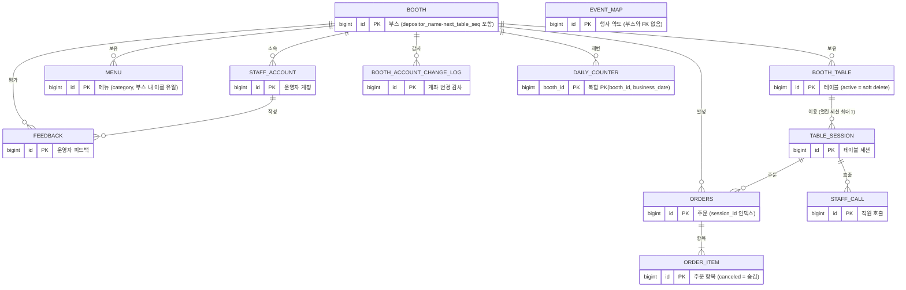

# 부스락 DB 스키마 v1.4

> 원천: API 명세서 v0.6 §6 데이터 모델 + 통합 PR(`integ/pos-backend`, HEAD f7aac1d) 엔티티. 대상 DB: **운영 RDS MySQL 8.0**, 로컬 개발·테스트는 H2(`;MODE=MySQL`).
> v1.1: MySQL 8.4·H2 실행 검증 — 멱등키 NULL 허용, password_hash 72자, call→staff_call, 세션 유일성 제약, utf8mb4, 타임존·조건부 UPDATE 원칙.
> v1.2: 토큰·멱등키 `utf8mb4_bin`, ended_at_key를 자기 id 방식으로. v1.2.1: `orders.table_label`.
> v1.3: `booth.category·map_x·map_y`, `booth_table.pos_x·pos_y`, `event_map` 신설, 좌석 현황을 세션으로 판정(원칙 14).
> v1.4.1: `booth_table.grid_row·grid_col` 신설(파일럿 전용, 명세서 밖) — 운영자가 숫자로 직접 입력하는 행/열, pos_x·pos_y(픽셀 드래그)와 별개.
> v1.4.2: `table_session.party_size`, `order_item.item_type` 신설(둘 다 파일럿 전용, 명세서 밖) — 자릿세. `order_item.menu_id`는 NULL 허용으로 완화(SEAT_FEE 행은 실제 메뉴가 없음).
> **v1.4 변경 (2026-09-16, 통합 PR 반영 — 코드가 정본)**: ① **문서 미기재였던 컬럼 5개 편입** — `booth.next_table_seq`, `booth_table.active`, `menu.category`, `order_item.canceled`, 제약 `uk_menu_booth_name(booth_id, name)` (deploy-mysql §5 실측) ② `booth_table.status`는 **VARCHAR(20)** — 엔티티에 `@JdbcTypeCode(VARCHAR)`를 붙여 MySQL 네이티브 ENUM 생성을 막았다 ③ **`idx_orders_session(session_id)`** 인덱스 신설(엔티티 `@Index` + 운영 SQL) ④ **운영 스키마는 `schema-mysql8.sql`을 먼저 적용하고 `ddl-auto=validate`로 기동** — 토큰 3컬럼의 `utf8mb4_bin`은 Hibernate가 만들 수 없다(원칙 17·18) ⑤ 원칙 15 **잠금 뒤 읽기**, 원칙 16 **미결제 정의**, 원칙 13 정정(인증 전환 완료), 원칙 14 갱신(미결제 예외) ⑥ §4를 "실습 코드 차이"에서 **"문서 ↔ Hibernate 자동 DDL ↔ 운영 SQL 차이표"** 로 교체 ⑦ **`booth.depositor_name VARCHAR(50) NULL`**(예금주명, main #57 → 통합 PR #54 병합) 편입.
> 규칙: 엔티티에는 반드시 `@Table(name = "...")`로 아래 테이블명을 명시한다. 담당은 파트로 적는다(부스·테이블·메뉴·주문·대시보드·정산·홈).

## 0. 전체 관계도 (ERD)



## 1. 테이블별 상세 정의 + 소유 파트

### booth — 부스 (부스 파트)

| 컬럼 | 타입 | 제약 | 설명 |
|---|---|---|---|
| id | BIGINT | PK, AUTO_INCREMENT | |
| name | VARCHAR(50) | NOT NULL | 부스명 |
| bank_account | VARCHAR(100) | NOT NULL | 계좌 표기 문자열 — C3 응답에 그대로 노출. 변경은 감사 로그 필수 |
| **depositor_name** | VARCHAR(50) | NULL | **v1.4 편입(main #57)** — 예금주명, 계좌 등록 화면 표시용 라벨. O17에서 ADMIN만 변경, trim 후 50자, null·공백은 NULL 저장. 입금 경로를 바꾸지 않는 표시값이라 `bank_account`와 달리 **감사 로그·웹훅 대상이 아니다**. C3 결제 안내에는 나가지 않는다 |
| is_open | BOOLEAN | NOT NULL DEFAULT TRUE | 주문 접수 스위치 — FALSE면 C3·O14·O23 증가가 409 ORDER_CLOSED |
| operating_hours | VARCHAR(50) | NULL | 안내용 텍스트 |
| category | VARCHAR(20) | NULL | 홈 화면 부스 분류 `FOOD` / `CAFE` / `GOODS` / `ETC`. **대문자 정확 일치 저장**(O17·시더가 검증). E1 필터는 대소문자 무시. NULL이면 미분류 |
| map_x | INT | NULL | 약도 위 핀 가로 위치, **0~10000 상대 좌표**. 엔티티 `Integer`(기존 행 NULL 대비) |
| map_y | INT | NULL | 세로 위치. **엔티티 `updateMapPosition`이 반쪽 좌표를 거부**한다(둘 다 null 또는 둘 다 값). E1은 한쪽만 있으면 둘 다 null로 내려준다 |
| **next_table_seq** | INT | NOT NULL DEFAULT 1 | **v1.4 편입** — O25 "테이블 추가" 자동 채번(`T-N`) 카운터. 부스 행 `FOR UPDATE` + `refresh` 아래에서 읽고, **컬럼 단독 UPDATE**(`TableSequenceRepository.setNextTableSeq`)로 올린다. **v0.6.3부터 채번 판정에 쓰지 않는 기록용**(마지막으로 낸 번호+1) — 채번은 활성 테이블의 `T-N` 최댓값+1이다(API 명세 O25). 엔티티는 `columnDefinition = "integer default 1"` — 컬럼이 생기기 전 행·raw INSERT도 1로 채워지게 |

- 엔티티 `@DynamicUpdate` — O17 저장(전체 컬럼 UPDATE였다면)이 동시에 채번된 `next_table_seq`를 옛 값으로 되돌려 이후 테이블 추가가 라벨 중복으로 영구 실패하던 결함(audit2 H3)의 수정
### staff_account — 운영자 계정 (부스 파트)

| 컬럼 | 타입 | 제약 | 설명 |
|---|---|---|---|
| id | BIGINT | PK, AUTO_INCREMENT | |
| booth_id | BIGINT | FK→booth, **NULL 허용** | SUPER_ADMIN은 무소속(NULL) |
| login_id | VARCHAR(50) | NOT NULL, **UNIQUE** | 부스명에서 유추 불가한 값으로 발급(시더) |
| password_hash | VARCHAR(72) | NOT NULL | bcrypt — `{bcrypt}` 접두 포함 68자 |
| password_changed_at | DATETIME | NOT NULL | JWT `pwdAt`(epoch초) 대조 |
| role | VARCHAR(20) | NOT NULL | SUPER_ADMIN / ADMIN / STAFF — 문자열 저장, `@JdbcTypeCode(VARCHAR)` |
| active | BOOLEAN | NOT NULL DEFAULT TRUE | 정지 시 FALSE — 매 요청 확인 |
| failed_login_count | INT | NOT NULL DEFAULT 0 | 5회부터 잠금 |
| locked_until | DATETIME | NULL | 잠금 해제 시각 |

### booth_table — 테이블 (테이블 파트) — `TABLE`은 예약어라 booth_table

| 컬럼 | 타입 | 제약 | 설명 |
|---|---|---|---|
| id | BIGINT | PK, AUTO_INCREMENT | |
| booth_id | BIGINT | FK→booth, NOT NULL | |
| label | VARCHAR(20) | NOT NULL | 원본 표기(trim) 저장. 정규화(하이픈·공백 제거·대문자, 영숫자 1~6자, 단독 M 금지)는 검증·orderNo 조립 시점. **정규화 기준 부스 내 유일성은 앱이 검증**(삭제된 테이블 라벨 포함) — 원본 UNIQUE만으로는 "A-3"과 "A3"을 못 막는다 |
| table_token | VARCHAR(64) | NOT NULL, **UNIQUE**, **`COLLATE utf8mb4_bin`** | QR 속 비밀값. **bin 필수**(원칙 17). 코드도 조회 뒤 `equals`로 재대조한다 |
| status | **VARCHAR(20)** | NOT NULL DEFAULT 'EMPTY' | EMPTY / OCCUPIED. **v1.4: 엔티티에 `@JdbcTypeCode(SqlTypes.VARCHAR)` 추가** — 없으면 Hibernate가 MySQL에 네이티브 `enum('EMPTY','OCCUPIED')`를 만든다(실측). C1 새 세션 시 OCCUPIED, **O6 퇴실 시 EMPTY**(v1.3의 "되돌리는 코드가 없다"는 해소). 그래도 **좌석 집계의 근거로 쓰지 않는다**(원칙 14) |
| pos_x | INT | NULL | 운영자 배치도 가로 px(캔버스 좌상단 원점), **0~10000**(O22가 반올림·범위 검증). NULL = 미배치 |
| pos_y | INT | NULL | 세로 px. 엔티티 `Integer` |
| grid_row | INT | NULL | **v1.4.1 편입** — 파일럿 전용(명세서 밖). 운영자가 숫자로 직접 입력하는 행 번호, **1~50**(O22b가 범위·중복 검증). pos_x/pos_y(픽셀 드래그, 파일럿 이후 재사용 예정)와는 별개 개념. NULL = 미배치 |
| grid_col | INT | NULL | 열 번호. 엔티티 `Integer` |
| **active** | BOOLEAN | NOT NULL DEFAULT TRUE | **v1.4 편입** — soft delete. O26이 **이용 이력(세션)이 있는 마지막 테이블**을 삭제할 때 FALSE로 둔다(과거 주문·세션 FK 보존). 이력 없는 테이블은 행을 지운다. FALSE인 테이블은 C1·O4·O5·O6·O22·O22b·O10·O14·O24에서 404, O3·E1·O4b·O16 tableCount에서 제외. 라벨 UNIQUE는 active와 무관하게 걸리므로, O25가 같은 번호를 다시 낼 때는 새 행을 넣지 않고 이 행을 TRUE로 되살린다(토큰 유지). 엔티티 `columnDefinition = "boolean default true"` |
| _UNIQUE_ | | **uq_booth_label (booth_id, label)** | |

- 엔티티 `@DynamicUpdate` — C1의 OCCUPIED 전환이 동시에 저장된 O5 새 토큰·O22 좌표·삭제(active=false)를 덮지 않게

### table_session — 테이블 세션 (테이블 파트)

| 컬럼 | 타입 | 제약 | 설명 |
|---|---|---|---|
| id | BIGINT | PK, AUTO_INCREMENT | O3 `session.id`·O10 `sessionId`로 노출된다(v1.4) |
| table_id | BIGINT | FK→booth_table, NOT NULL | |
| session_token | VARCHAR(64) | NOT NULL, **UNIQUE**, **`COLLATE utf8mb4_bin`** | 손님 인증값(X-Session-Token). 코드도 `equals` 재대조 |
| started_at | DATETIME | NOT NULL | |
| ended_at | DATETIME | NULL | **NULL = 열린 세션** — O6 퇴실·C1 유휴 재발급 시 기록 |
| last_activity_at | DATETIME | NOT NULL | C1 복원·C2~C6 인증·C3 저장이 **조건부 UPDATE**(`touchIfActive`: `where ended_at is null and ended_at_key = 0`)로 갱신 — 0건이면 410 |
| ended_at_key | BIGINT | NOT NULL DEFAULT 0 | 열린 세션 = 0, **종료 시 자기 id**. 종료는 항상 `ended_at`과 같은 UPDATE 문장에서 함께 쓴다 |
| **party_size** | INT | NULL | **v1.4.2 편입(명세서 밖, 자릿세 파일럿)** — PartySizePage 제출값(1~20). NULL = 미선택(자릿세 미부과). `PATCH /table-sessions/party-size`가 조건부 UPDATE로 저장 |
| _UNIQUE_ | | **uq_session_active (table_id, ended_at_key)** | 테이블당 열린 세션 1개를 DB가 강제 |

- **"열린 세션" 조회·갱신에는 `ended_at IS NULL AND ended_at_key = 0`을 함께 건다.** 인덱스가 `uq_session_active` 하나라 `ended_at IS NULL`만으로는 그 테이블의 종료된 세션을 전부 읽는다(MySQL 8.4 실측: 5만 건에서 27ms → 1ms)
- 엔티티 `@DynamicUpdate` — 퇴실과 동시에 들어온 활동 기록이 전체 컬럼을 쓰면 `ended_at`·`ended_at_key`를 되돌려 종료된 세션이 되살아나던 결함(audit2 B4)의 수정. 활동 기록·종료는 전부 조건부 UPDATE
- 세션 생성 진입점은 C1과 O14(C1 경로 재사용) 두 곳 — 둘 다 테이블 행 `FOR UPDATE` 아래에서 판정하고, 유니크 제약은 최후 방어선

### menu — 메뉴 (메뉴 파트)

| 컬럼 | 타입 | 제약 | 설명 |
|---|---|---|---|
| id | BIGINT | PK, AUTO_INCREMENT | |
| booth_id | BIGINT | FK→booth, NOT NULL | |
| name | VARCHAR(50) | NOT NULL | trim 후 1~50자 |
| price | INT | NOT NULL, ≥0(앱 검증) | |
| image_url | VARCHAR(500) | NULL | O9 결과 `/uploads/menu/{uuid}.jpg` |
| description | VARCHAR(200) | NULL | |
| sold_out | BOOLEAN | NOT NULL DEFAULT FALSE | 원클릭 품절. 재고 수량 컬럼 없음 |
| visible | BOOLEAN | NOT NULL DEFAULT TRUE | 숨김 — DELETE 없음 |
| **category** | VARCHAR(20) | NULL | **v1.4 편입(main #53)** — `MAIN` / `SIDE` / `DRINK`(손님 메뉴판 탭과 1:1). **문자열 컬럼 + 코드 화이트리스트**(`MenuService.VALID_CATEGORIES`, 대문자 정확 일치) — `@Enumerated`로 두면 MySQL 네이티브 ENUM이 생겨 분류를 늘릴 때 ALTER가 필요하다. NULL = 분류 없음('전체' 탭에만). **NOT NULL 금지** — 기존 행이 있는 테이블에 컬럼을 덧붙이므로 |
| _UNIQUE_ | | **uk_menu_booth_name (booth_id, name)** | **v1.4 편입** — 부스 내 메뉴명 중복 금지. 앱은 사전 검사 + 제약 위반을 409 INVALID_STATE로 변환 |

### orders — 주문 (주문 파트) — `ORDER`는 예약어라 orders

| 컬럼 | 타입 | 제약 | 설명 |
|---|---|---|---|
| id | BIGINT | PK, AUTO_INCREMENT | |
| booth_id | BIGINT | NOT NULL (엔티티는 `Long`, 운영 SQL이 FK 부여) | |
| session_id | BIGINT | **NULL 허용** (운영 SQL FK→table_session) | 테이블 미지정 수기 주문은 NULL |
| table_label | VARCHAR(20) | NULL | 주문 시점 라벨 원본 스냅샷(O10 표시·CSV용). 수기 미지정 NULL |
| order_no | VARCHAR(20) | NOT NULL | "A3-17" / "M-5" — 영업일 내에서만 유일 |
| business_date | DATE | NOT NULL | (생성시각 − 6h)의 날짜 |
| order_seq | INT | NOT NULL | 부스 영업일 통산 순번 |
| idempotency_key | VARCHAR(64) | **NULL 허용**, UNIQUE, **`COLLATE utf8mb4_bin`** | 수기 주문은 NULL. NOT NULL로 바꾸면 수기 INSERT 실패, UNIQUE 제거하면 더블탭 방지 소멸 — 조합 유지 |
| status | VARCHAR(20) | NOT NULL | RECEIVED / DONE / CANCELED (`@JdbcTypeCode(VARCHAR)`) |
| payment_status | VARCHAR(20) | NOT NULL | UNPAID / PAID / REFUND_NEEDED / REFUNDED |
| payment_method | VARCHAR(20) | NULL | BANK_TRANSFER / CASH — 입금 확인(O11·O24) 시 기록 |
| total_amount | INT | NOT NULL | 서버 재계산. **취소 안 된 항목의 합** — O23·O23b가 다시 계산해 저장 |
| cancel_reason | VARCHAR(100) | NULL | O13 사유(빈 값이면 "운영자 취소"), 항목 전체 취소는 "전체 항목 취소" |
| canceled_by / canceled_at | VARCHAR(50) / DATETIME | NULL | 손님 취소는 `CUSTOMER`, 운영자는 loginId |
| approved_by / approved_at | VARCHAR(50) / DATETIME | NULL | 입금 승인자·시각 |
| refunded_by / refunded_at | VARCHAR(50) / DATETIME | NULL | |
| is_manual | BOOLEAN | NOT NULL DEFAULT FALSE | 응답 필드명은 `manual` |
| hidden | BOOLEAN | NOT NULL DEFAULT FALSE | **v1.4 신설(명세서 밖)** — 취소 주문 삭제. 실제 삭제가 아니라 대시보드 목록·탭 건수에서만 제외, 결제·정산 데이터는 그대로 |
| created_at | DATETIME | NOT NULL | 마이크로초 절삭 저장 |
| _UNIQUE_ | | **uq_orders_seq (booth_id, business_date, order_seq)** | 채번 최후 방어선 |
| _INDEX_ | | **idx_orders_search (booth_id, business_date, order_no)** | O10 검색·영업일 조회 |
| _INDEX_ | | **idx_orders_session (session_id)** | **v1.4 신설** — O6 퇴실 경고·O3 미결제 집계·O10 `activeSessionOnly`·O24 대상·C1 유휴 판정·C4가 session_id로 찾는다. 없으면 부스 인덱스 앞부분만 타고 그 부스 주문을 훑는다. 엔티티 `@Index`와 운영 SQL이 같은 이름 |

- 엔티티 `@DynamicUpdate`. 상태 전이(O11·O12·O13·O21·O23b 마지막 항목)는 조건부 UPDATE(원칙 9), 항목 편집·C5는 행 잠금(원칙 15)
- paymentGuide(계좌 안내 문구)·subtotal·canCancel은 컬럼이 아니다(원칙 3)

### order_item — 주문 항목 (주문 파트)

| 컬럼 | 타입 | 제약 | 설명 |
|---|---|---|---|
| id | BIGINT | PK, AUTO_INCREMENT | O10 `items[].itemId` — O23·O23b 경로 파라미터 |
| order_id | BIGINT | FK→orders, NOT NULL | |
| menu_id | BIGINT | **NULL 허용(v1.4.2 완화)** | 참조용(FK 없음) — 본체는 스냅샷. `item_type='SEAT_FEE'` 행은 실제 메뉴가 없어 NULL |
| menu_name | VARCHAR(50) | NOT NULL | 스냅샷. SEAT_FEE 행은 항상 `"자릿세"` |
| unit_price | INT | NOT NULL | 스냅샷 |
| qty | INT | NOT NULL, 1~30(앱 검증) | O23으로 변경 가능(같은 상한). SEAT_FEE 행은 인원수(1~20) |
| **canceled** | BOOLEAN | NOT NULL DEFAULT FALSE | **v1.4 편입** — O23b 개별 취소. **행을 지우지 않고 숨긴다**(감사·정산 보존). TRUE인 행은 O10·C4·C3 멱등 재응답의 items와 `total_amount` 합산에서 빠진다. 엔티티 `columnDefinition = "boolean default false"` |
| **item_type** | VARCHAR(20) | NOT NULL DEFAULT 'MENU' | **v1.4.2 편입(명세서 밖, 자릿세 파일럿)** — `MENU` / `SEAT_FEE`. `OrderEntity.requireEditableItem`이 `MENU`만 골라 O23/O23b 대상으로 삼는다 — SEAT_FEE는 스태프가 수정·취소 못 한다(404). `@JdbcTypeCode(VARCHAR)`, 기존 컬럼들과 같은 이유로 네이티브 ENUM 금지 |

### daily_counter — 영업일 채번 카운터 (주문 파트)

| 컬럼 | 타입 | 제약 | 설명 |
|---|---|---|---|
| booth_id | BIGINT | **복합 PK** (운영 SQL FK→booth) | |
| business_date | DATE | **복합 PK** | |
| last_seq | INT | NOT NULL DEFAULT 0 | `SELECT ... FOR UPDATE` 후 +1 |

- Hibernate 자동 DDL은 PK 컬럼 순서를 `(business_date, booth_id)`로 만든다. 운영 SQL은 문서 순서 `(booth_id, business_date)` — validate는 순서를 보지 않는다
- 명세 §2의 `booth_daily_counter` 표기는 이 테이블

### staff_call — 직원 호출 (대시보드 파트) — `CALL`은 예약어라 staff_call

| 컬럼 | 타입 | 제약 | 설명 |
|---|---|---|---|
| id | BIGINT | PK, AUTO_INCREMENT | |
| session_id | BIGINT | FK→table_session, NOT NULL | 부스 스코프는 세션→테이블→부스 조인 |
| reason | VARCHAR(10) | NOT NULL | HELP / WATER / ETC (`@JdbcTypeCode(VARCHAR)`) |
| acked | BOOLEAN | NOT NULL DEFAULT FALSE | O15로 TRUE — O10은 FALSE만 노출 |
| created_at | DATETIME | NOT NULL | 30초 쿨다운 판정 재료 |

### feedback — 운영자 피드백 (정산 파트)

| 컬럼 | 타입 | 제약 | 설명 |
|---|---|---|---|
| id | BIGINT | PK, AUTO_INCREMENT | |
| booth_id | BIGINT | NOT NULL (엔티티 `Long`, 운영 SQL FK→booth) | |
| staff_id | BIGINT | NOT NULL (운영 SQL FK→staff_account) | |
| rating | INT | NOT NULL, 1~5(앱 검증) | |
| easy_setup / easy_orders / would_reuse | BOOLEAN ×3 | NOT NULL | |
| comment | VARCHAR(1000) | NULL | |
| created_at | DATETIME | NOT NULL | **주의**: 이 엔티티만 `LocalDateTime.now()`(JVM 기본 시간대)를 쓴다 — 컨테이너 시간대를 KST로 고정해야 한다(원칙 8, 배포 문서의 `JAVA_TOOL_OPTIONS`) |

### booth_account_change_log — 계좌 변경 감사 (부스 파트)

| 컬럼 | 타입 | 제약 | 설명 |
|---|---|---|---|
| id | BIGINT | PK, AUTO_INCREMENT | |
| booth_id | BIGINT | FK→booth, NOT NULL | |
| changed_by | VARCHAR(50) | NOT NULL | 변경한 계정 loginId |
| changed_at | DATETIME | NOT NULL | |
| old_value / new_value | VARCHAR(100) ×2 | NOT NULL | |

### event_map — 행사 약도 (홈 파트)

| 컬럼 | 타입 | 제약 | 설명 |
|---|---|---|---|
| id | BIGINT | PK, AUTO_INCREMENT | |
| image_url | VARCHAR(300) | NOT NULL | `/uploads/event/…` — API 서버 기준 상대 경로 |
| width | INT | NOT NULL | 원본 px |
| height | INT | NOT NULL | |
| updated_at | DATETIME | NOT NULL | |

- 파일럿은 1건. E2는 `id DESC` 1건. 부스와 FK 없음. 등록은 시더(파일 존재 확인)

## 2. DDL (MySQL 8 — 참고용)

> **운영은 이 DDL이 아니라 `backend/docs/schema-mysql8.sql`(배포 갈래 산출물)을 먼저 적용하고 `spring.jpa.hibernate.ddl-auto=validate`로 기동한다** (원칙 18). 아래는 그 SQL과 같은 내용을 문서용으로 요약한 것이며, 정밀도·CHECK·FK 이름은 §4 차이표를 따른다. 로컬 개발(H2)은 `ddl-auto=update`.
> 전 테이블 utf8mb4 고정. 토큰·멱등키 3컬럼은 `utf8mb4_bin`.

```sql
CREATE TABLE booth (
  id              BIGINT AUTO_INCREMENT PRIMARY KEY,
  name            VARCHAR(50)  NOT NULL,
  bank_account    VARCHAR(100) NOT NULL,
  depositor_name  VARCHAR(50)  NULL,
  is_open         BOOLEAN      NOT NULL DEFAULT TRUE,
  operating_hours VARCHAR(50),
  category        VARCHAR(20)  NULL,
  map_x           INT          NULL,
  map_y           INT          NULL,
  next_table_seq  INT          NOT NULL DEFAULT 1
) ENGINE=InnoDB DEFAULT CHARSET=utf8mb4 COLLATE=utf8mb4_0900_ai_ci;

CREATE TABLE staff_account (
  id                  BIGINT AUTO_INCREMENT PRIMARY KEY,
  booth_id            BIGINT NULL,
  login_id            VARCHAR(50) NOT NULL UNIQUE,
  password_hash       VARCHAR(72) NOT NULL,
  password_changed_at DATETIME(6) NOT NULL,
  role                VARCHAR(20) NOT NULL,
  active              BOOLEAN     NOT NULL DEFAULT TRUE,
  failed_login_count  INT         NOT NULL DEFAULT 0,
  locked_until        DATETIME(6) NULL,
  CONSTRAINT fk_staff_booth FOREIGN KEY (booth_id) REFERENCES booth(id),
  CONSTRAINT chk_staff_role CHECK (role IN ('SUPER_ADMIN','ADMIN','STAFF'))
) ENGINE=InnoDB DEFAULT CHARSET=utf8mb4 COLLATE=utf8mb4_0900_ai_ci;

CREATE TABLE booth_table (
  id          BIGINT AUTO_INCREMENT PRIMARY KEY,
  booth_id    BIGINT      NOT NULL,
  label       VARCHAR(20) NOT NULL,
  table_token VARCHAR(64) COLLATE utf8mb4_bin NOT NULL UNIQUE,
  status      VARCHAR(20) NOT NULL DEFAULT 'EMPTY',
  pos_x       INT         NULL,
  pos_y       INT         NULL,
  grid_row    INT         NULL,
  grid_col    INT         NULL,
  active      BOOLEAN     NOT NULL DEFAULT TRUE,
  CONSTRAINT fk_table_booth FOREIGN KEY (booth_id) REFERENCES booth(id),
  CONSTRAINT uq_booth_label UNIQUE (booth_id, label),
  CONSTRAINT chk_table_status CHECK (status IN ('EMPTY','OCCUPIED'))
) ENGINE=InnoDB DEFAULT CHARSET=utf8mb4 COLLATE=utf8mb4_0900_ai_ci;

CREATE TABLE table_session (
  id               BIGINT AUTO_INCREMENT PRIMARY KEY,
  table_id         BIGINT      NOT NULL,
  session_token    VARCHAR(64) COLLATE utf8mb4_bin NOT NULL UNIQUE,
  started_at       DATETIME(6) NOT NULL,
  ended_at         DATETIME(6) NULL,
  last_activity_at DATETIME(6) NOT NULL,
  ended_at_key     BIGINT      NOT NULL DEFAULT 0,
  party_size       INT         NULL,
  CONSTRAINT fk_session_table FOREIGN KEY (table_id) REFERENCES booth_table(id),
  CONSTRAINT uq_session_active UNIQUE (table_id, ended_at_key)
) ENGINE=InnoDB DEFAULT CHARSET=utf8mb4 COLLATE=utf8mb4_0900_ai_ci;

CREATE TABLE menu (
  id          BIGINT AUTO_INCREMENT PRIMARY KEY,
  booth_id    BIGINT       NOT NULL,
  name        VARCHAR(50)  NOT NULL,
  price       INT          NOT NULL,
  image_url   VARCHAR(500) NULL,
  description VARCHAR(200) NULL,
  sold_out    BOOLEAN      NOT NULL DEFAULT FALSE,
  visible     BOOLEAN      NOT NULL DEFAULT TRUE,
  category    VARCHAR(20)  NULL,
  CONSTRAINT fk_menu_booth FOREIGN KEY (booth_id) REFERENCES booth(id),
  CONSTRAINT uk_menu_booth_name UNIQUE (booth_id, name)
) ENGINE=InnoDB DEFAULT CHARSET=utf8mb4 COLLATE=utf8mb4_0900_ai_ci;

CREATE TABLE orders (
  id              BIGINT AUTO_INCREMENT PRIMARY KEY,
  booth_id        BIGINT       NOT NULL,
  session_id      BIGINT       NULL,
  table_label     VARCHAR(20)  NULL,
  order_no        VARCHAR(20)  NOT NULL,
  business_date   DATE         NOT NULL,
  order_seq       INT          NOT NULL,
  idempotency_key VARCHAR(64)  COLLATE utf8mb4_bin NULL UNIQUE,
  status          VARCHAR(20)  NOT NULL,
  payment_status  VARCHAR(20)  NOT NULL,
  payment_method  VARCHAR(20)  NULL,
  total_amount    INT          NOT NULL,
  cancel_reason   VARCHAR(100) NULL,
  canceled_by     VARCHAR(50)  NULL,
  canceled_at     DATETIME(6)  NULL,
  approved_by     VARCHAR(50)  NULL,
  approved_at     DATETIME(6)  NULL,
  refunded_by     VARCHAR(50)  NULL,
  refunded_at     DATETIME(6)  NULL,
  is_manual       BOOLEAN      NOT NULL DEFAULT FALSE,
  hidden          BOOLEAN      NOT NULL DEFAULT FALSE,
  created_at      DATETIME(6)  NOT NULL,
  CONSTRAINT fk_orders_booth   FOREIGN KEY (booth_id)   REFERENCES booth(id),
  CONSTRAINT fk_orders_session FOREIGN KEY (session_id) REFERENCES table_session(id),
  CONSTRAINT uq_orders_seq     UNIQUE (booth_id, business_date, order_seq),
  CONSTRAINT chk_orders_status         CHECK (status IN ('RECEIVED','DONE','CANCELED')),
  CONSTRAINT chk_orders_payment_status CHECK (payment_status IN ('UNPAID','PAID','REFUND_NEEDED','REFUNDED')),
  CONSTRAINT chk_orders_payment_method CHECK (payment_method IN ('BANK_TRANSFER','CASH'))
) ENGINE=InnoDB DEFAULT CHARSET=utf8mb4 COLLATE=utf8mb4_0900_ai_ci;

CREATE INDEX idx_orders_search  ON orders (booth_id, business_date, order_no);
CREATE INDEX idx_orders_session ON orders (session_id);

CREATE TABLE order_item (
  id         BIGINT AUTO_INCREMENT PRIMARY KEY,
  order_id   BIGINT      NOT NULL,
  menu_id    BIGINT      NULL,
  menu_name  VARCHAR(50) NOT NULL,
  unit_price INT         NOT NULL,
  qty        INT         NOT NULL,
  canceled   BOOLEAN     NOT NULL DEFAULT FALSE,
  item_type  VARCHAR(20) NOT NULL DEFAULT 'MENU',
  CONSTRAINT fk_item_order FOREIGN KEY (order_id) REFERENCES orders(id)
) ENGINE=InnoDB DEFAULT CHARSET=utf8mb4 COLLATE=utf8mb4_0900_ai_ci;

CREATE TABLE daily_counter (
  booth_id      BIGINT NOT NULL,
  business_date DATE   NOT NULL,
  last_seq      INT    NOT NULL DEFAULT 0,
  PRIMARY KEY (booth_id, business_date),
  CONSTRAINT fk_counter_booth FOREIGN KEY (booth_id) REFERENCES booth(id)
) ENGINE=InnoDB DEFAULT CHARSET=utf8mb4 COLLATE=utf8mb4_0900_ai_ci;

CREATE TABLE staff_call (
  id         BIGINT AUTO_INCREMENT PRIMARY KEY,
  session_id BIGINT      NOT NULL,
  reason     VARCHAR(10) NOT NULL,
  acked      BOOLEAN     NOT NULL DEFAULT FALSE,
  created_at DATETIME(6) NOT NULL,
  CONSTRAINT fk_call_session FOREIGN KEY (session_id) REFERENCES table_session(id),
  CONSTRAINT chk_call_reason CHECK (reason IN ('HELP','WATER','ETC'))
) ENGINE=InnoDB DEFAULT CHARSET=utf8mb4 COLLATE=utf8mb4_0900_ai_ci;

CREATE TABLE feedback (
  id           BIGINT AUTO_INCREMENT PRIMARY KEY,
  booth_id     BIGINT        NOT NULL,
  staff_id     BIGINT        NOT NULL,
  rating       INT           NOT NULL,
  easy_setup   BOOLEAN       NOT NULL,
  easy_orders  BOOLEAN       NOT NULL,
  would_reuse  BOOLEAN       NOT NULL,
  comment      VARCHAR(1000) NULL,
  created_at   DATETIME(6)   NOT NULL,
  CONSTRAINT fk_fb_booth FOREIGN KEY (booth_id) REFERENCES booth(id),
  CONSTRAINT fk_fb_staff FOREIGN KEY (staff_id) REFERENCES staff_account(id)
) ENGINE=InnoDB DEFAULT CHARSET=utf8mb4 COLLATE=utf8mb4_0900_ai_ci;

CREATE TABLE booth_account_change_log (
  id         BIGINT AUTO_INCREMENT PRIMARY KEY,
  booth_id   BIGINT       NOT NULL,
  changed_by VARCHAR(50)  NOT NULL,
  changed_at DATETIME(6)  NOT NULL,
  old_value  VARCHAR(100) NOT NULL,
  new_value  VARCHAR(100) NOT NULL,
  CONSTRAINT fk_log_booth FOREIGN KEY (booth_id) REFERENCES booth(id)
) ENGINE=InnoDB DEFAULT CHARSET=utf8mb4 COLLATE=utf8mb4_0900_ai_ci;

CREATE TABLE event_map (
  id         BIGINT AUTO_INCREMENT PRIMARY KEY,
  image_url  VARCHAR(300) NOT NULL,
  width      INT          NOT NULL,
  height     INT          NOT NULL,
  updated_at DATETIME(6)  NOT NULL
) ENGINE=InnoDB DEFAULT CHARSET=utf8mb4 COLLATE=utf8mb4_0900_ai_ci;
```

- CHECK 제약 이름(`chk_*`)은 이 문서의 표기다 — `schema-mysql8.sql`의 실제 이름과 다를 수 있다(**확정 필요**: 그 파일은 이 트리에 없어 대조하지 못했다)

## 3. 설계 원칙 (전 파트 공통 — 어기면 사고 나는 것들)

1. **SQL 예약어 회피**: `table`→`booth_table`, `order`→`orders`, `call`→`staff_call`. `@Table(name = "...")` 명시 필수
2. **enum은 전부 문자열 저장** — `@Enumerated(STRING)` + **`@JdbcTypeCode(SqlTypes.VARCHAR)`** 둘 다. 후자가 없으면 Hibernate 6/7이 MySQL에 네이티브 ENUM 컬럼을 만든다(v1.4에서 `booth_table.status`가 이 함정에 걸려 있었음). 코드 화이트리스트로 검사하는 문자열 컬럼(`booth.category`·`menu.category`)은 enum 매핑을 쓰지 않는다
3. **파생값은 저장하지 않는다** — canCancel, subtotal, paymentGuide, needsCleanup, unpaidOrderCount
4. **스냅샷은 저장한다** — order_item의 menu_name·unit_price, orders.table_label
5. **돈이 움직이는 곳엔 누가·언제** — approved/canceled/refunded_by·at, 계좌 변경 로그
6. **삭제 없음** — 메뉴는 visible=FALSE, 주문·세션은 상태 종결, 항목은 canceled=TRUE, 테이블은 active=FALSE. **유일한 예외**: 이용 이력이 전혀 없는 마지막 테이블은 O26이 행을 지운다(FK 참조가 없어 안전)
7. **unique 제약은 최후 방어선** — 채번·멱등키·토큰·세션 활성 1개·메뉴명. 코드가 먼저 막고 DB가 다시 막는다
8. **타임존 고정 (Asia/Seoul)** — MySQL DATETIME은 타임존을 저장하지 않는다. JDBC URL `serverTimezone=Asia/Seoul`, 컨테이너 `JAVA_TOOL_OPTIONS=-Duser.timezone=Asia/Seoul`(빌드 파일의 `-Duser.timezone`은 `java -jar`에 적용되지 않음). 코드는 대부분 `ZoneId.of("Asia/Seoul")`을 명시하지만 `feedback.created_at`은 JVM 기본 시간대를 쓴다
9. **상태 갱신은 조건부 UPDATE** — O11·O12·O13·O21·O23b 마지막 항목·세션 종료·활동 기록 전부 `UPDATE ... WHERE 현재상태`이고 0건이면 409/410. 조회→검사→갱신 분리는 동시 클릭에서 기록을 덮는다
10. **표시 좌표는 표시 전용** — `booth.map_x·map_y`, `booth_table.pos_x·pos_y`
11. **약도 좌표는 상대값(0~10000), 배치도 좌표는 픽셀(0~10000 상한)** — 컬럼명 `map_`·`pos_`로 갈라 둔다
12. **공개 API가 읽는 컬럼은 노출 범위가 곧 명세다** — `booth`의 `id·name·category·is_open·map_x·map_y`, 테이블·세션 집계 숫자, `event_map`만. `bank_account`는 절대 나가지 않는다
13. **복수 부스 격리 — 완료 (v1.4 정정)**: v1.3이 선행 조건으로 적은 O10·C6·O15의 인증 전환은 통합 PR에서 끝났다. 부스 스코프는 JWT, 세션 스코프는 X-Session-Token. 쿼리·본문의 `boothId`·`sessionId`는 신뢰하지 않고 400으로 거절한다
14. **좌석 현황은 `status`가 아니라 세션으로 판정한다 (v1.4 갱신)** — 차 있는 테이블 = 열린 세션(`ended_at IS NULL AND ended_at_key = 0`)이면서 `last_activity_at > 현재 − 유휴임계` **또는 현재 영업일의 미결제 주문(원칙 16)이 있는** 세션이 붙은 테이블. 정의는 `SeatIdlePolicy` 한 곳이고 C1 복원·O3 `session/needsCleanup`·E1 집계가 함께 쓴다. 집계 쿼리의 세션 조건은 JOIN `ON`에 둔다(WHERE에 두면 세션 없는 테이블이 통째로 빠진다). `active = true` 테이블만 센다
15. **잠금 뒤 읽기 — 격리 수준에 기대지 않는다 (v1.4 신설)**: 판정에 쓰는 값(주문 상태·항목·열린 세션·미결제 건수·채번 카운터·마지막 테이블)은 `SELECT ... FOR UPDATE`로 잠금을 얻은 **뒤에, 잠금 읽기로만** 읽는다. 서비스 트랜잭션은 인증용 일반 SELECT로 시작하므로 MySQL REPEATABLE READ에서는 그 시점 스냅샷이 끝까지 고정되고, 잠금을 기다린 뒤 일반 조회·지연 로딩으로 다시 읽으면 상대가 커밋한 변경(항목 취소·퇴실·세션 생성·채번)이 보이지 않는다(MySQL 8.4 실측: 두 항목 동시 취소가 RECEIVED로 잔존, 퇴실 경고에서 주문 누락, 삭제 테이블에 열린 세션 잔존). 규칙: ① 컬렉션 `join fetch`에 `@Lock`을 걸어도 Hibernate가 FOR UPDATE를 떼므로 항목은 네이티브 `select * from order_item where order_id=? for update`로 읽는다 ② 같은 요청에서 먼저 올라온 관리 엔티티는 잠금 조회가 필드를 덮어쓰지 않으므로 `entityManager.refresh(e, PESSIMISTIC_WRITE)`로 다시 읽는다 ③ `count(...) FOR UPDATE`는 H2가 거부하므로 행을 읽어 크기로 센다. 운영 풀은 READ COMMITTED로 두지만(배포 문서) 이 원칙은 그 설정이 빠져도 성립한다 — H2·MySQL RR·MySQL RC 세 조건에서 전체 테스트 645건 통과
16. **미결제의 정의는 하나 (v1.4 신설)**: `status IN ('RECEIVED','DONE') AND payment_status = 'UNPAID'` — 서빙 여부와 무관하게 입금이 안 된 주문. `UnpaidOrderRule.JPQL_CONDITION` 상수를 O3 건수·O6 경고·O24 대상·유휴 예외(C1·O3)·E1 집계 다섯 쿼리가 그대로 잇고 `UnpaidOrderRuleConsistencyTests`가 12조합 일치를 검사한다. C3 상한(429)·C5·O23 판정의 `RECEIVED AND UNPAID`는 다른 목적이라 이 정의에 넣지 않는다
17. **토큰·멱등키 3컬럼은 `utf8mb4_bin` 필수 (v1.4 승격)**: `booth_table.table_token`, `table_session.session_token`, `orders.idempotency_key`. 기본 `utf8mb4_0900_ai_ci`는 대소문자를 무시해 `AbCdEf`로 저장한 토큰이 `abcdef`로 인증된다(실측). **Hibernate `ddl-auto`는 콜레이션을 만들 수 없다** — 엔티티에 `columnDefinition`으로 넣으면 H2가 깨지므로 코드는 조회 뒤 `equals` 재대조로 한 겹 더 막고(`TableSessionService`·`TableSessionAuthService`), 운영 스키마 SQL이 bin을 부여한다
18. **운영 스키마는 SQL 선적용 + `ddl-auto=validate` (v1.4 신설)**: 첫 배포에서 `update`를 쓰지 않는다. 이유는 원칙 17(콜레이션)과 §4 차이표(FK·인덱스·PK 순서·네이티브 ENUM). `validate`는 컬럼·타입 누락은 잡지만 콜레이션·추가 인덱스·FK·CHECK는 보지 않으므로 통과한다(실측 기동 2.9초). 컬럼을 추가하는 코드 변경은 반드시 SQL 마이그레이션을 함께 낸다

## 4. 문서 ↔ Hibernate 자동 DDL ↔ 운영 SQL 차이표 (deploy-mysql §5 실측, MySQL 8.4 `create`)

> v1.3의 §4(실습 코드 ↔ 팀 스키마)는 통합으로 소멸했다. 이 표는 **"이 문서대로 되어 있다고 믿으면 틀리는 곳"** 이다 — Hibernate가 `update`로 만든 로컬 H2/MySQL 스키마와 운영 SQL은 아래 항목에서 다르다.

| 항목 | 이 문서(v1.4) | Hibernate 자동 DDL | 운영 `schema-mysql8.sql` | 비고 |
|---|---|---|---|---|
| DATETIME 정밀도 | DATETIME(6) | `datetime(6)` | DATETIME(6) | v1.3은 `DATETIME`으로 적었으나 실제는 마이크로초. 코드가 `truncatedTo(MICROS)`로 맞춘다 |
| BOOLEAN | BOOLEAN | `bit(1)` (columnDefinition 있는 `active`·`canceled`는 `tinyint(1)`) | BOOLEAN | validate 통과(Connector/J `tinyInt1isBit=true`) |
| `booth_table.status` | VARCHAR(20) + CHECK | v1.4 코드부터 `varchar(20)` + CHECK (그 전엔 네이티브 `enum`) | VARCHAR(20) + CHECK | `@JdbcTypeCode(VARCHAR)` 추가로 해소 |
| 열거형 CHECK | 있음(이름 부여) | orders 3·staff_account·staff_call·booth_table에 생성, 이름은 해시 | 이름 부여 | |
| 토큰·멱등키 콜레이션 | `utf8mb4_bin` | **없음(ai_ci)** | `utf8mb4_bin` | 원칙 17 |
| `idx_orders_session` | 있음 | v1.4 코드부터 있음(`@Index`) | 있음 | 같은 이름 |
| FK orders→booth/session, feedback→booth/staff, daily_counter→booth | 있음 | **없음**(엔티티가 `Long` 참조) | 있음 | 코드는 FK 없이도 동작. 운영 SQL이 무결성을 더한다 |
| 제약 이름 | `fk_*`·`uq_*`·`uk_*` | 해시(`uq_*`·`uk_menu_booth_name`·`uq_session_active`·`uq_orders_seq`는 엔티티에 명시돼 동일) | 문서 이름 | |
| `daily_counter` PK 순서 | (booth_id, business_date) | (business_date, booth_id) | 문서 순서 | validate 무관 |
| `next_table_seq`·`active`·`menu.category`·`uk_menu_booth_name`·`canceled` | v1.4 편입 | 있음 | 있음 | v1.3 문서에만 없던 5개 |
| `booth.depositor_name` | v1.4 편입(main #57) | 있음(통합 PR #54가 main 병합 후) | **확인 필요** — 운영 SQL은 #57 병합 전에 작성돼 이 컬럼이 없을 수 있다. 없으면 `ALTER TABLE booth ADD COLUMN depositor_name VARCHAR(50) NULL` 추가 후 validate | validate는 컬럼 누락을 잡으므로 빠져 있으면 기동 실패로 드러난다 |
| DEFAULT 절 | 있음 | 없음(`columnDefinition` 있는 3컬럼 제외) | 있음 | 앱은 항상 값을 넣으므로 동작 차이 없음 |
| **`order_item.menu_id` NOT NULL → NULL 완화(v1.4.2)** | NULL 허용 | **완화 안 됨** — 기존 H2 파일에 이미 만들어진 컬럼의 제약은 `ddl-auto=update`가 안 바꾼다(실측, 2026-09-24) | NULL 허용(CREATE TABLE 반영) | **이미 떠 있던 DB에는 배포 전에 직접 바꿔야 한다.** 로컬 H2 파일: `ALTER TABLE order_item ALTER COLUMN menu_id SET NULL`(또는 파일 재생성). **운영 RDS(MySQL 8.0)는 아래 "v1.4.2 운영 RDS 마이그레이션"을 새 코드 배포 전에 실행.** validate는 NULL 허용 여부를 검사하지 않아, 컬럼 두 개만 추가하고 이 완화를 빠뜨리면 서버는 정상 기동하는데 모든 첫 주문(자릿세 행)이 500으로 죽는다 |

#### v1.4.2 운영 RDS 마이그레이션 (MySQL 8.0 — 새 코드 배포 **전에** 실행)

현재 운영 코드와도 호환된다(새 컬럼은 NULL 허용/기본값 `'MENU'`라 옛 코드의 INSERT가 그대로 통과) — 그래서 "ALTER 먼저, 배포 나중" 순서가 안전하다.
컬럼 두 개가 없으면 `ddl-auto=validate`가 `missing column [item_type]`으로 기동을 막는다(로컬 MySQL 8.0 실측).

```sql
ALTER TABLE table_session ADD COLUMN party_size INT NULL, ALGORITHM=INSTANT;
ALTER TABLE order_item ADD COLUMN item_type VARCHAR(20) NOT NULL DEFAULT 'MENU', ALGORITHM=INSTANT;
ALTER TABLE order_item MODIFY COLUMN menu_id BIGINT NULL, ALGORITHM=INPLACE, LOCK=NONE;  -- 따로 실행(재구성, 동시 DML 허용)
-- 확인: SHOW CREATE TABLE order_item;  (menu_id가 NULL 허용, item_type 존재)  SHOW CREATE TABLE table_session; (party_size 존재)
```

- 기존 H2 파일 DB(구 스키마) 위에 통합본을 `ddl-auto=update`로 띄우면 `menu.category`만 NULL 허용으로 추가되고 기동·회귀가 통과함을 실측(verify-int2 §6). `next_table_seq`·`active`·`canceled`는 기본값이 있어 기존 행이 채워진다. **주의**: 이건 "새 컬럼 추가"라 되는 것이고, `order_item.menu_id`처럼 **기존 컬럼의 NOT NULL 제약을 완화**하는 변경은 `update`가 다루지 않는다(바로 위 행 참고) — 이 둘을 같은 사례로 착각하지 말 것
- MySQL 전체 테스트: REPEATABLE READ 645/645, READ COMMITTED 645/645, 데드락·lock wait timeout 0 (port-fix2). RDS 8.0은 미실측 — 파라미터 그룹(격리수준·`binlog_format` ROW/MIXED·인증 플러그인)은 배포 문서 확인
